## 第一关

1. justify-content:flex-end 从主轴的最后对齐，必须使用display flex，不reverse右对齐，reverse后左对齐
2. column-reverse 后从顶部对齐，column 从底部对齐

## 第二关
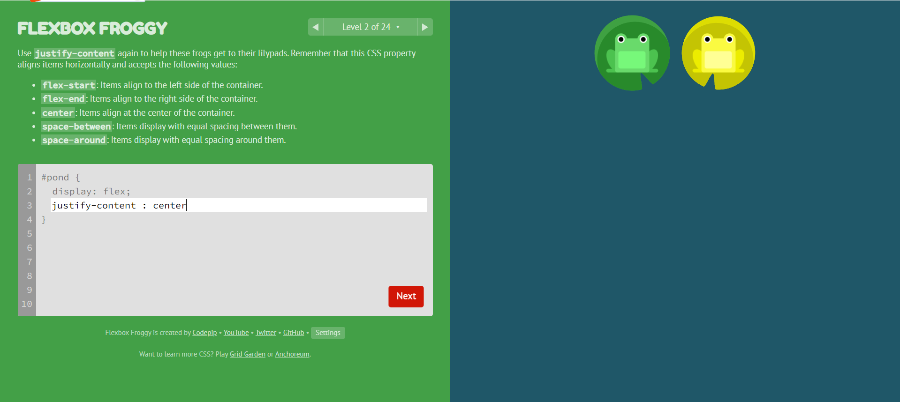
1. center 主轴方向对齐，row是行上对齐，colum是列上居中对齐

## 第三关
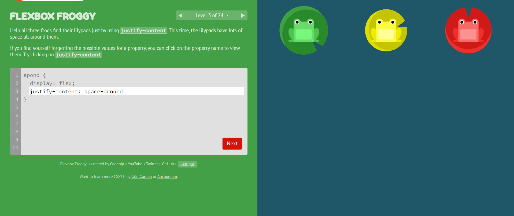
1. justify-content: space-around 将所有的子元素在主轴上设置为距离相等

## 第四关
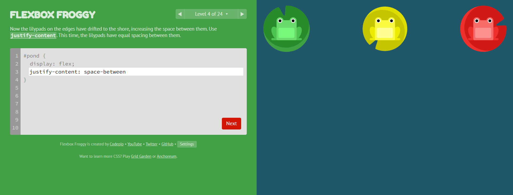
1. justify-content: space-bewteen 将所有的子元素，第一个在主轴的开头，最后一个在主轴的最后，其他元素平分当中的距离。row是如图的布局，column则变成列方向，第一个元素在上，最后的在下，其他平分中间距离；reverse 则是布局相反

## 第五关
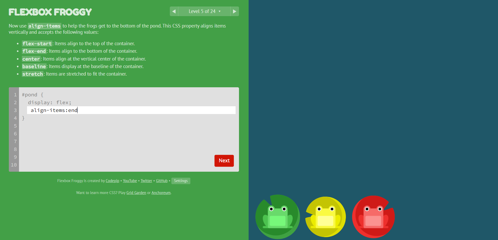
1. align-items:flex-end(end) 在交叉轴的尾部对齐，如果是column-reverse则是在视觉上的右侧，因为column-reverse只控制主轴不控制交叉轴

## 第六关

1. align-items: center 交叉轴的居中位置
2. justify-content： center 主轴的居中位置

## 第七关
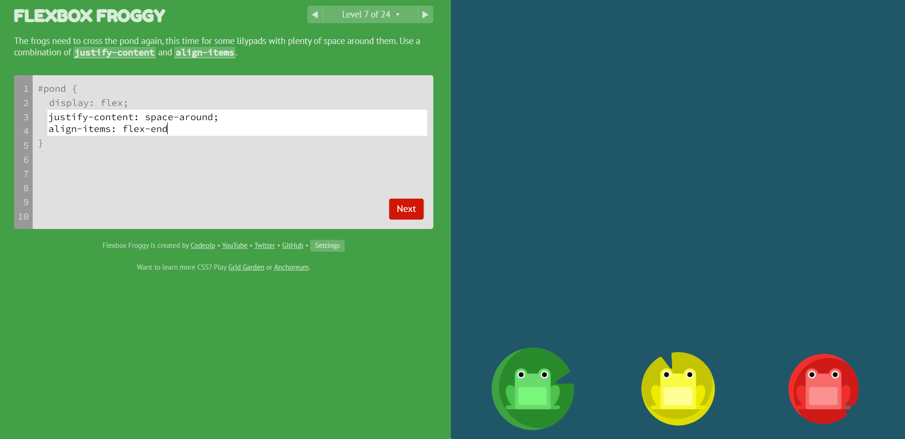
1. align-items: flex-end 交叉轴的尾部位置
2. justify-content： space-around 子元素按主轴方向平均分配

## 第八关
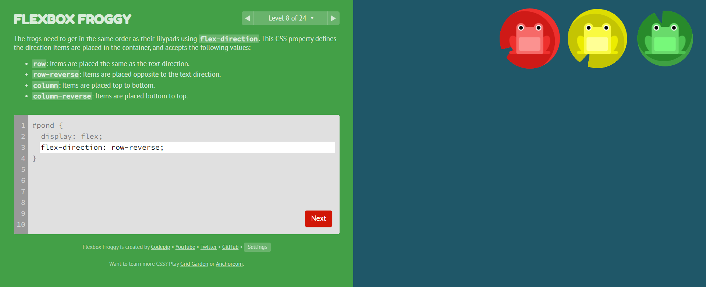
1. row-reverse在行上翻转对齐，尾部变头部，头部变尾部

## 第九关

1. column 主轴变成列，按列布局

## 第十关
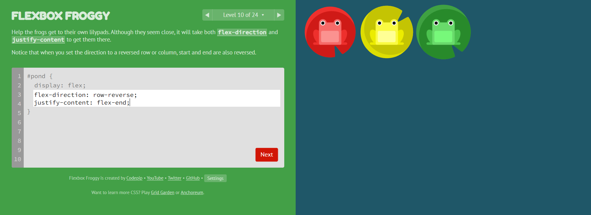
1. 先按照row-reverse翻转，再justify-content按照尾部对齐

## 第十一关
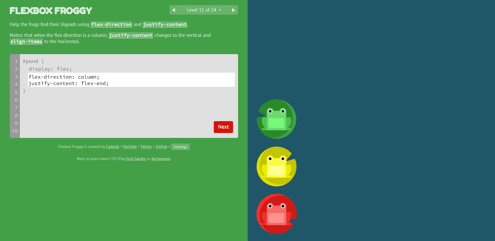
1. 先flex-direction 按照列对齐，再justify-content 按照flex-end对齐

## 第十二关
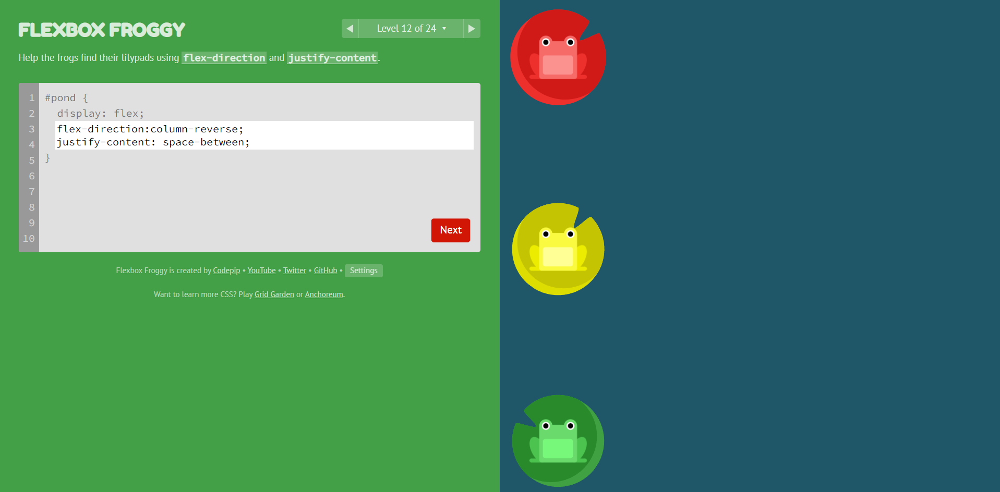
1. 先按照列对齐，再翻转，最后space-between按照第一个元素再下（reverse翻转），最后一个元素在上，中间的空间平分

## 第十三关
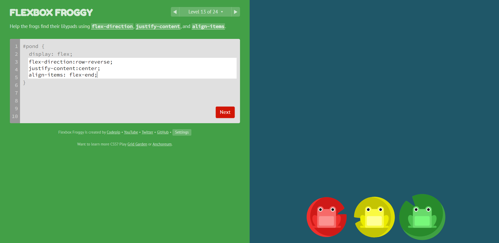
1. 先按照row-reverse翻转主轴，再center按主轴居中，最后align-item按交叉轴放置尾部

## 第十四关
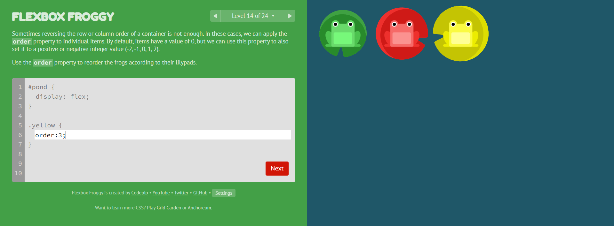
1. 元素默认顺序是（0，0，0），现在给yellow加order3，让它在第三个位置

## 第十五关
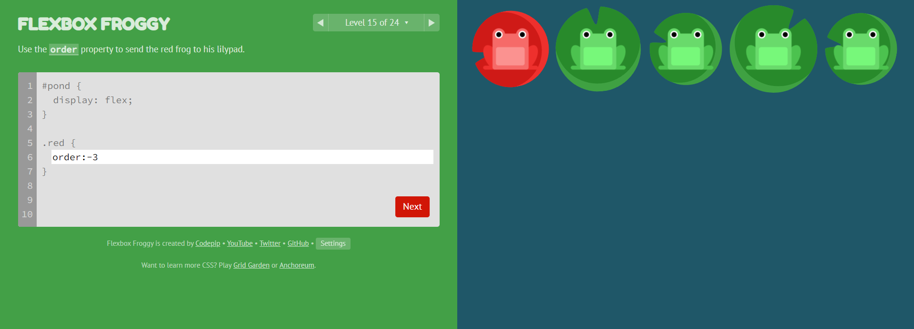
1. 按照顺序，将红色青蛙放在-3的位置

## 第十六关
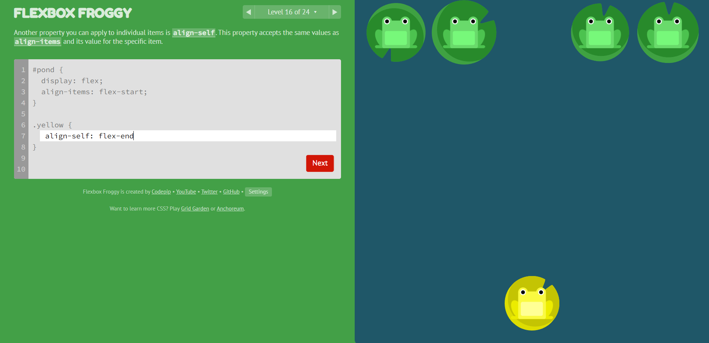
1. alien-self 只将选中的元素根据交叉轴方向放置在合适位置，能使用的属性与alien-items 一致

## 第十七关
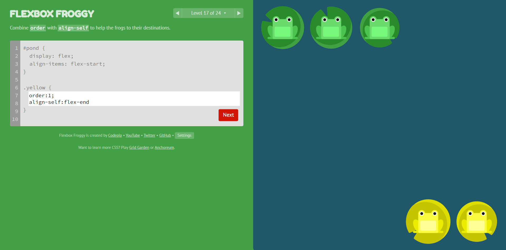
1. 先按照order把所有黄色元素放到1位置，将其他绿色挤到0的位置；再选中黄色元素，放到交叉轴的底部

## 第十八关
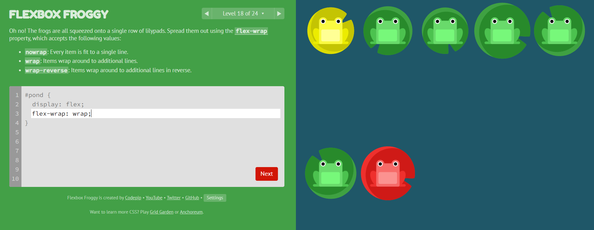
1. flex-wrap按照主轴换行

## 第十九关
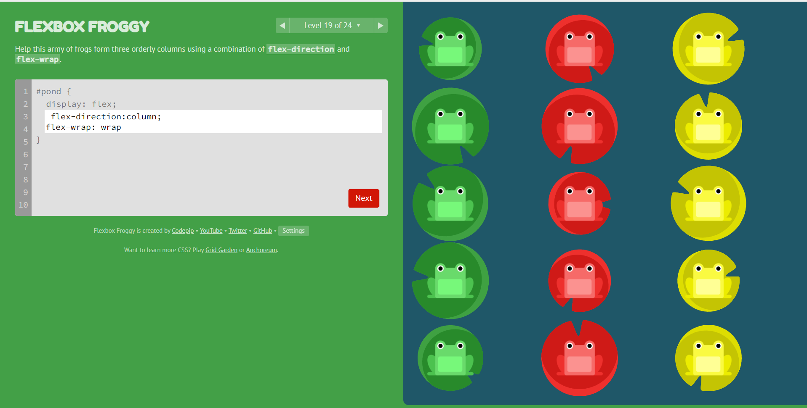
1. 先按照主轴换成列对齐，再用flex-wrap 按照主轴自动换行

## 第二十关
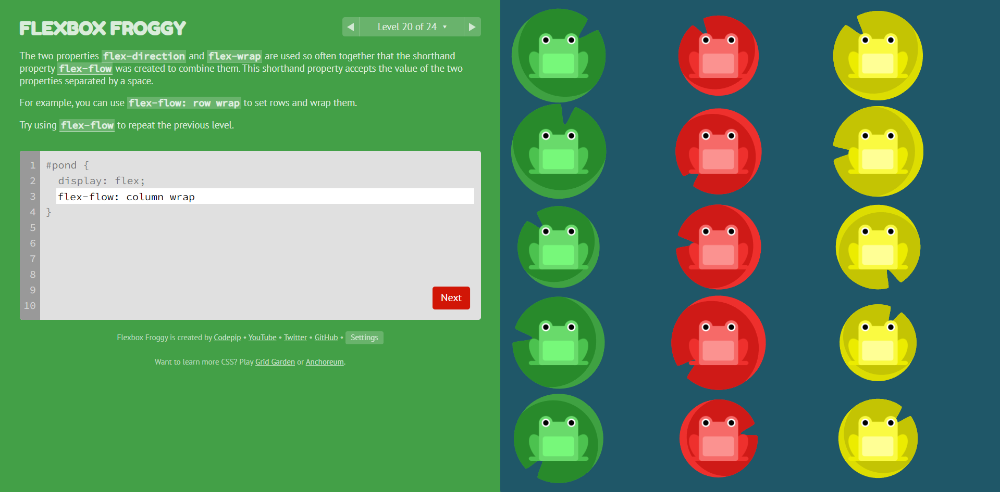
1. flex-flow 将flex-direction和flex-wrap写在一起

## 第二十一关
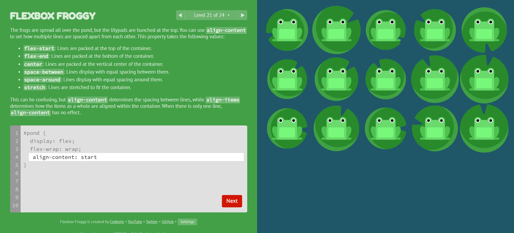
1. 按照交叉轴放置头部，由于只有一个item，无法使用align-item，只能用align-content

## 第二十二关
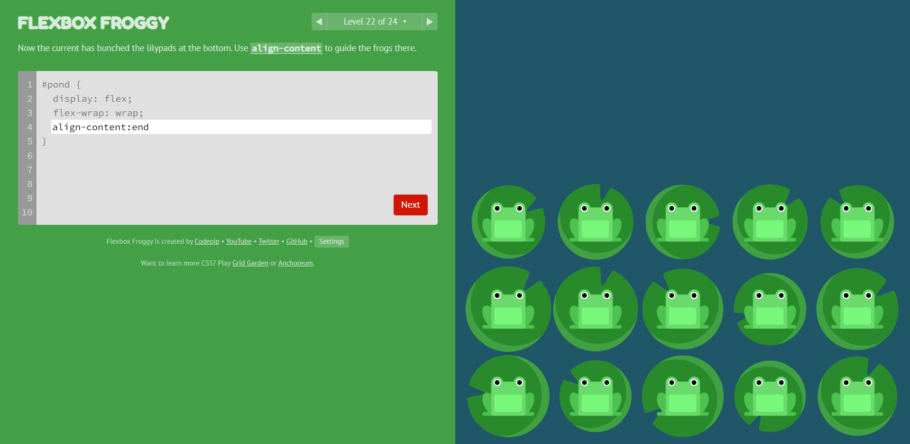
1. 按照交叉轴放置尾部，由于只有一个item，无法使用align-item，只能用align-content

## 第二十三关
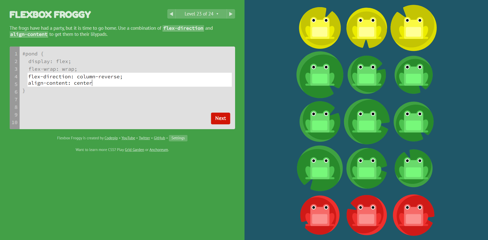
1. 按照列对齐，再翻转，最后按照交叉轴居中

## 第二十四关
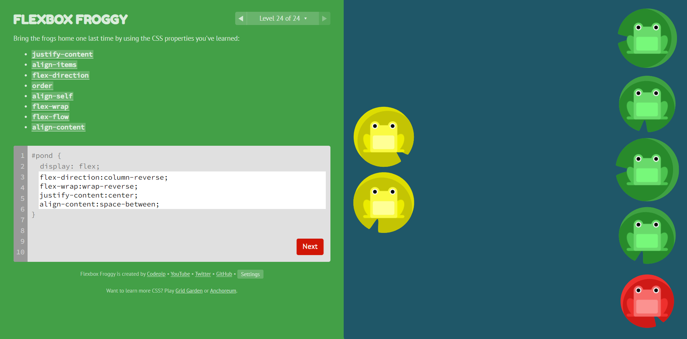
先按照column-reverse翻转，再按照wrap-reverse翻转换行，最后主轴居中，交叉轴两边对齐

